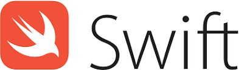

# Swift (linguagem de programação)

## Sobre o Swift
Swift é uma linguagem de programação criada pela *Apple Inc*. para desenvolvimento de programas para suas próprias plataformas (*iOS*, *macOS*, *watchOS*, *tvOS*) e *Linux*. Essa linguagem destina-se a ser uma alternativa mais simples e eficaz ao desenvolvimento de softwares para suas plataformas do que o *Objective-C* (linguagem anteriormente usada).
Sua construção visa a elaboração de códigos mais enxutos e mais resilientes à erros, com otimizações no desempenho e uma alta expressividade. Além disso foi projetada para trabalhar com os frameworks da Apple, Cocoa e Cocoa touch, e com códigos em Objective-C. 
## Origens e Influências
O desenvolvimento da linguagem Swift pela Apple começou em julho de 2010, com o programador Chris Lattner liderando o projeto. Em 2014 na Conferência Mundial de Desenvolvedores da Apple (**WWDC**), ocorreu a divulgação de uma versão beta da linguagem para desenvolvedores registrados Apple, juntamente com seu manual gratuito.

Sua primeira versão foi oficialmente lançada em setembro de 2014, sendo submetidas atualizações para a versão 1.1 em outubro e 1.2 em abril do ano seguinte. Na WWDC 2015 foi anunciada uma atualização mais importante para Swift 2.0, sendo disponibilizada em setembro do mesmo ano e se tornando uma linguagem de código aberto em dezembro. Swift 3.0 foi lançado em 13 de setembro de 2016.Atualmente, Swift encontra-se na sua versão 4.0, oficialmente lançada em 19 de setembro de 2017.

De acordo com o próprio desenvolvedor, Swift foi influenciada por diversas linguagens, buscando inspiração principalmente nas seguintes: **Objective-C**, **Rust**, **Haskell**, **Ruby**, **Python**, **C#**, **CLU**.
## Classificação
Swift é uma linguagem de programação compilada e multiparadigma, sendo extremamente versátil e dando suporte aos seguintes tipos de programação:
* Orientada a objetos
Swift permite a criação de classes e todas as outras características de programação orientada a objetos como herança, encapsulamento e polimorfismo
```swift
class Person {
    var firstName: String?
    var lastName: String?
    let gender = "female"
}
```
* Funcional
* Imperativa

Além disso, trata-se de uma linguagem de uso geral, podendo ser usada para desenvolver diversos tipos de software para as plataformas compatíveis, e que possui uma tipagem forte e estática, porém possuindo também inferência de tipo, como podemos ver no código abaixo.
```swift
   var stringVar1:String = "Ola Mundo"
   var stringVar2 = "Ola Mundo"
```

## Comparação com Outras linguagens
Swift é uma linguagem que possui características inspiradas nas principais linguagens de programação atuais, buscando obter o máximo de expressividade ao utilizar o que há de melhor em cada uma delas. Porém, ela também possui suas próprias expressividades particulares.
De acordo com as pesquisas realizadas sobre sua versão 2.0, Swift possui um desempenho muito melhor do que o Objective-C e Python, além de possuir uma performance média quase na mesma velocidade de C++.

### Read/Write:
O principal objetivo do swift é ser uma linguagem de fácil escrita, e isso pode ser observado pela simplicidade da linguagem, onde com apenas algumas linhas de código podemos escrever programas completos.Porém como ela apresenta alguns paradigmas diferentes das linguagens mais convencionais como (quais paradigmas) ,sua leitura pode acabar se tornando algo mais complicado em certos programas, tornando C e Java,por exemplo, linguagens de leitura mais fácil.Já quando falamos de escrita, Swift é uma linguagem bastante simples, assim como Python e Java, já que a linguagem possui uma série de vantagens na sua sintaxe tornando a elaboração de códigos bem mais simples daqueles em C.

``` swift

var carros: String[] = ["Fusca", "Fiat 147", "Opala", "Outros"]
for Carro in carros {
   println(Carro)
}

if let typed = readLine() {
  if let num = Int(typed) {
      print(num)
  }
}
```

### Swift vs C
Apesar de possuir grande parte de sua estrutura básica similar à linguagens baseadas em C, Swift possui um grande número de diferenças e funcionalidade extras, principalmente em comportamentos que são conhecidos como grandes geradores de erros. Algumas das principais diferenças são:
* Não é necessário o uso de `;` ao final de cada declaração;
* Os ponteiros não são expostos por padrão;
* Não há necessidade de break em blocos `switch`;
* As variáveis e constantes sempre são inicializadas e os limites da matriz sempre são verificados;
* O formulário de uma declaração de `if` e `while`, que permite a omissão de chaves ao redor da instrução, não é suportado;


Código fatorial recursivo em Swift vs C
``` swift
//Swift 
func factorial(n: UInt32) -> UInt64 {
    if n == 0 {
        return 1
    } else {
        return n * factorial(n - 1)
    }
}
``` 
``` C
//C
long factorial(int n){
  if (n == 0)
    return 1;
  else
    return(n * factorial(n-1));
}
``` 

### Swift vs Python
Grande parte da capacidade de Swift de gerar códigos enxutos e de fácil entendimento deve-se a uma sintaxe muito similar à de Python. Porém suas comparações não estão restritas a esse aspecto da linguagem:
* A forma de declarar e lidar com strings e arrays nas duas linguagens, com uma visão mais parecida com listas, é extremamente similar;
* Swift apresenta uma tipagem forte e estática, com suporte a constante, o que já não ocorre em Python, que permite até mesmo listas com tipos diversos e mudança nos tipos das variáveis.
* Ambas as linguagens trabalham funções de forma similar, inclusive dando suporte a múltiplos valores de retorno.

Tipagem em Python vs Swift
``` Python
# Python
name = "Felipe" # string variable, but can change
name = 42        # would run
n = 42           # currently an int
d = 42.0         # currently a float
```
``` swift
// Swift
var name = "Felipe" // string
name = 42            // Error
var n = 42           // int
var d = 42.0         // double
```

Funções retornando múltiplos valores em Swift vs Python
``` Swift
// Swift
func compareMinMax(a: Int, b: Int) -> (min: Int, max: Int) {
    if a > b {
        return (b, a)
    } else {
        return (a, b)
    }
}
var (a, b) = compareMinMax(10,20)
```
``` Python
#Python
def compareMinMax(a,b):
    if a > b:
        return (b,a)
    else :
        return (a,b)
        
a,b = compareMinMax(10,20)
```

### Swift vs Java
A principal comparação que pode ser feita com relação a Java é quanto a redigibilidade. Swift é uma linguagem que não necessita de muitas linhas de código para expressar pequenas funcionalidades, já que não necessita sempre de uma função `main` e de classes, podendo funcionar como uma linguagem de script quando necessário.
Outro ponto de diferenças entre elas é em relação à inferência de tipos presente em Swift e o retorno de valores múltiplos, ambos não suportados em Java. Por outro lado, o comportamento relativo a Strings e objetos é semelhante em ambas as linguagens, já que Swift inclusive conta com alguns conceitos como herança e interface que são extremamente presentes em Java. Além disso, Swift apresenta alguns novos recurso em relação a objetos como por exemplo o conceito de protocolos.

Código Hello world 
``` Swift
//Swift
print("Hello, world!")
```
``` Java
#Java
public class HelloWorld {
    public static void main(String[] args) {
        System.out.println("Hello, world!");
    }
}
```

Comparando tipagem 
```Swift
// Swift
let e: Int = 5
var a = 5.678; // implicit Double
a = a + Double(e)
print("\(e) \(a)")
```
``` Java
# Java
public class Typing {
       public static void main(String[] args) {
        final int e = 5;
        double a = 5.678;
        a = a + e;
        System.out.println(e + " " + a);
    }
}
```

Classes em Swift vs Java
``` Swift
//Swift
class Nome {
    var name: String
    init(name: String) {
        self.name = name
    }
}
 
let aClass = SomeClass(name: "Felipe")
let bClass = aClass
bClass.name = "Rodrigo"
print(aClass.name) // "Rodrigo"
print(bClass.name) // "Rodrigo"
```
```Java
//Java
public class SomeClass {
    public String name;
    public SomeClass(String name) {
        this.name = name;
    }
}
public class Program {
    public static void main(String[] args) {
        final SomeClass aClass = new SomeClass("Felipe");
        final SomeClass bClass = aClass;
        aClass.favLang = "Rodrigo";
        System.out.println(aClass.name); // "Rodrigo"
        System.out.println(bClass.name); // "Rodrigo"
    }
}
```
### Protocolos
Em swift existe a ideia de protocolos, que nada mais é do que um escopo que define tanto métodos quanto propriedades a uma classe ou a uma estrutura existente, sempre lembrando que para estar em conformidade com um protocolo, uma classe ou estrutura deve ter todas as suas funcionalidades implementadas. Os protocolos possuem uma funcionalidade similar à herança na orientação a objetos do Java porém sem nenhuma associação fortemente vinculada, além disso o conceito de protocolos se estende não só a classes como também para structs e enums, enquanto heranças são restritas a classes. 

Vale lembrar também que com protocolos podemos implementar o conceito de múltiplas heranças, algo que em algumas linguagens de programação não existe. Esse aspecto dos protocolos faz com que seu comportamento se assemelhe bastante também com o conceito de Interfaces em Java, porém possuindo mais funcionalidades do que estas. Como alguma das principais diferenças entre esses conceitos podemos citar a definição de propriedades, ou seja, definição de campos que as classes ou estruturas que adotam esse protocolo devem possuir; a implementação de métodos opcionais, usando a keyword ```@objc```, e métodos padrões, através da keyword ```extension```. Essas funcionalidades auxiliam principalmente na redução de códigos duplicados ou desnecessários. 

Além disso, podemos combinar protocolos a qualquer momento usando ```protocol<>```. Isso é útil para, por exemplo, definir uma variável que deve estar de acordo com dois protocolos A e B da seguinte forma:
```swift
func foo ( var1 : protocol<A, B> ){}
```

Protocolos são tão importantes e possuem um poder de expressão tão grande, que um novo paradigma de programação denominado **programação orientada a protocolos** passou a ser utilizado por muitos desenvolvedores nos últimos anos. Esse paradigma tem seu foco principalmente na maneira que um objeto interage com o ambiente, similar a idéia de uma interface, em vez do próprio objeto, obtendo uma visão mais generalizada e objetiva do que está sendo feito.

``` swift
protocol Drivable {
    var topSpeed: Int { get }
}
 
protocol Reversible {
    var reverseSpeed: Int { get }
}
 
protocol Transport {
    var seatCount: Int { get }
}

struct Car: Drivable, Reversible, Transport {
    var topSpeed = 150
    var reverseSpeed = 20
    var seatCount = 5
}
```
### Tipos e Métodos Opcionais
Em swift temos a implementação do opcional, que é um tipo por conta própria, na verdade, um dos novos enums mais poderosos de Swift, quando declaramos um tipo como opcional ele pode ter dois comportamentos:
*	Se o opcional contém um 'valor', em seguida, chamando os seus bens relacionados, métodos e subscritos retorna seu valor.
*	Se o opcional contém um valor "nulo" todas as suas suas propriedades relacionadas, métodos e subscritos retornam nil.

Em Swift, ao criarmos variáveis de um determinado tipo, sem atribuir valores a ela que sabemos ser do tipo correto, estamos na realidade criando uma variável de tipo opcional, ou seja, ao realizarmos operações nessa varíavel que possa vir a gerar valores diferentes do tipo esperado, a sintaxe da linguagem obriga o código a testar se o valor retornado foi adequado.

Isso implica que tipos não-opcionais não podem resultar em um erro de ponteiro nulo,com o compilador podendo garantir que isso não é possível. A aplicação desses tipos opcionais na linguagem diminui a incidência de erros causados pela falta de checagem quanto ao retorno de valores de tipos não esperados, que muitas vezes causam resultados inesperados.

Para facilitar a integração da linguagem com esses recursos de tipos opcionais, foram desenvolvidos dois operadores ```?``` e ```!```, onde o primeiro indica que trata-se de um tipo opcional, que deve ser testado quanto a um possível valor ```nil```, e o segundo mostra o valor do opcional quando sabemos que esse valor existe e desejamos acessá-lo. Podemos utilizar também o ```?```, para tentar acessar uma varíavel de uma instância que pode não possuir um valor esperado, indicando que nesse caso desejamos testar se há o retorno esperado ou um valor vazio. Esses operadores facilitam a escrita de um código mais enxuto, porém podem vir a atrapalhar a leitura do código em algumas situações.

Esse conceito de ```Optionals``` já está presente em algumas outras linguagens de programação, podemos inclusive observar a influências que algumas linguagens já citadas anteriormente como Haskell e Rust tiveram sobre o desenvolvimento desse conceito em Swift, principalmente ao analisarmos que ao funcionamento desses tipos e métodos opcionais é extremamente similar a da keyword ```maybe``` em Haskell. 

Optional Values em Swift 
```Swift
let possibleNumber:String = 123
let convertedNumber = Int(possibleNumber) // returns an optional value
if convertedNumber != nil {
    print("convertedNumber value: \(convertedNumber)")  // "convertedNumber value: Optional(123)"
    print("convertedNumber value: \(convertedNumber!)") // "convertedNumber has an integer value of 123"
}
let a:Int? = 5  // optional variable
let b:Int  = 6  // normal variable
let c:Int! = 7  // implicitly unwrapped optional
 
print(a) // "Optional(5)"
print(b) // "6"
print(c) // "7"
 
let d:Int? = Int(possibleNumber)
let e:Int  = Int(possibleNumber)!
let f:Int! = Int(possibleNumber)
 
print(d) // "Optional(123)"
print(e) // "123"
print(f) // "123"
 
print(d!) // "123"
// print(e!) // not allowed
print(f!) // "123"

let noNumber = "hello"
let g:Int! = Int(noNumber)

print(g)  // "nil"
print(g!) // fatal error: unexpectedly found nil while unwrapping an Optional value
```

Optional values em Swift vs Java 
```Swift
# Swift
winSize = house?.windows?.get(2)?.size
```
```Java
#Java
if (house != null) {
    windows = house.windows;
    if (windows != null) {
        win = windows.get(2);
        if (win != null)
            winSize = win.size;
    }
}

```
## Conclusão

Swift é uma linguagem inovadora que apresenta inumeras novas funcionalidades, mesmo assim não perde a simplicidade das linguagens na qual foi inspirada, tornando a vida dos programadores de Swift muitos mais fácil.
Seja através da implementação de tipos opcionais, pela sua programação orientada a protocolos, ou de outras funcionalidades que oferecem um grande poder expressividade, Swift tem a capacidad de tornar códigos que antes eram complexos em outras linguagens, extremamente simples.

## Bibliografia

[Swift-Wikipedia](https://pt.wikipedia.org/wiki/Swift_(linguagem_de_programa%C3%A7%C3%A3o))

[Comparison of multi-paradigm programming languages-Wikipedia](https://en.wikipedia.org/wiki/Comparison_of_multi-paradigm_programming_languages)

[Comparison of Swift 2](https://blog.novatec-gmbh.de/swift-2-introduction-comparison/)

[Comparison of Python and Swift](https://blog.michaelckennedy.net/2014/11/26/comparison-of-python-and-apples-swift-programming-language-syntax/)

[Documentation of Swift-Apple](https://developer.apple.com/library/content/documentation/Swift/Conceptual/Swift_Programming_Language/)
